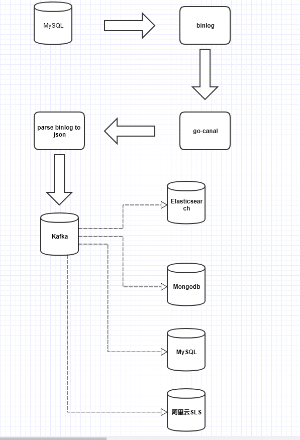

# go-mysql-kafka
监听binlog日志,并将其解析为json投递到kafka

### 如何使用

##### 工作流程
1、go-canal监听源数据库的binlog

2、数据库产生binlog,筛选被监听的表

3、解析binlog成json

4、投递到kafka

5、业务可以将kafka的消息投递到任何的下游存储中



##### 资源准备
* redis
* kafka:2.0+
* MySQL:5.6+

##### 确认数据库开始binlog
```shell script
MySQL [(none)]> show variables like 'log_bin';
+---------------+-------+
| Variable_name | Value |
+---------------+-------+
| log_bin       | ON    |
+---------------+-------+
1 row in set (0.01 sec)
```

```shell script
MySQL [(none)]> show master logs;
+------------------+-----------+
| Log_name         | File_size |
+------------------+-----------+
| mysql-bin.001403 |  25309244 |
| mysql-bin.001404 |  35811848 |
| mysql-bin.001405 |  46125076 |
| mysql-bin.001406 | 231169453 |
| mysql-bin.001407 |  20879902 |
| mysql-bin.001408 |  35196980 |
+------------------+-----------+
6 rows in set (0.01 sec)
```

##### 配置go-mysql-kafka配置
```toml
debug = true
env = "dev"
[sourceDB]
# <MySQL数据地址>
host = ""
port = 3306
username = "root"
# <数据密码>
password = ""
charset = ""
# server id like a slave,同时还作为ID生成器,如果有从库的请确保这个值的唯一性
serverID = 130
flavor = "mysql"
mysqldump = ""
# minimal items to be inserted in one bulk
bulkSize = 128
flushBulkTime = 200
skipNoPkTable = false
skipMasterData = false
# 文件形式存储binlog位置,一般不建议使用
dataDir = ""

# 指定需要被监听的表
[[sourceDB.sources]]
schema = "otam"
tables = ["student_sign_in_copy"]

#[[sourceDB.sources]]
#schema = "fonzie"
#tables = ["t", "t_[0-9]{4}", "tfield", "tfilter"]

#[[sourceDB.rule]]
#schema = "test"
#table = "t"
#index = "test"
#type = "t"

[http]
statAddr = "127.0.0.1:8000"
statPath = "/metrics"

[redis]
# redis的连接地址
host = "xxxxxxxxxxxxxxx:6379"
# 密码
password = "xxxxxxxxxxxxxxx"
maxIdle = 30
maxActive = 30
idleTimeout = 200
# binlog在redis的TTL,目前没有用到这个功能,
binlogTimeout = 900
# redis中存储的前缀
binlogPrefix = "CONFIG:xxxxxxxx-mysql-sync"

# 分表分库做映射
[mapper]
# 目前只兼容DRDS,DRDS分表分库后是：schemas_name.00001结构
schemas = ["xxxxxxxxxxxx"]

[kafka]
# kafka地址
brokers = ["xxxxxxxxxxxx:9093"]
# 设置kafka版本
version = "2.1.0"
# 跳过证书可信性检测,需要saslEnable开启
insecureSkipVerify = true
# 开启ssl访问
saslEnable = false
# 用户名
username = "alikafka_post-cn-xxxxxxx"
# 密码
password = "xxxxxxxxxxxxxx"
# ca证书,阿里云kafka公网接入demo:https://github.com/AliwareMQ/aliware-kafka-demos
# 帮助文档地址:https://help.aliyun.com/document_detail/99958.html?spm=5176.11065259.1996646101.searchclickresult.5fcc31f8N8MlXQ
certFile = "ca-cert"


[kafka.producer]
# 等待服务器所有副本都保存成功后的响应, NoResponse: 0 WaitForLocal: 1 WaitForAll: -1,发送完数据需要leader和follow都确认
requiredAcks = 1
# 生产者投递影响消息在partitioner上的分布
# Manual: 只投递到partition 0,一般用于保序
# RoundRobin: rr轮训模式
# Random: 随机投递
# Hash: Hash投递
# ReferenceHash:
# 默认rr模式
PartitionerType = "default"
# 是否等待成功和失败后的响应,只有上面的RequireAcks设置不是NoReponse这里才有用.
returnSuccesses = true
returnErrors = true
# 消息投递失败重试次数
retryMax = 5

# kafka版本低于0.11的版本这里不能为空
[[kafka.producer.headers]]
key = "xxxxxxxxx"
value = "xxxxxxxxxxxxxx"

# 默认目标topic是表名,如果要指定Topic就可以在这里配置对应关系
[[kafka.producer.mapper]]
sourceTable = "student_sign_in_copy"
topic = "student_sign_in_fonzie_copy"
```


### 参考&&感谢
* [bailaohe](https://github.com/bailaohe)
* [go-mysql](https://github.com/siddontang/go-mysql)


